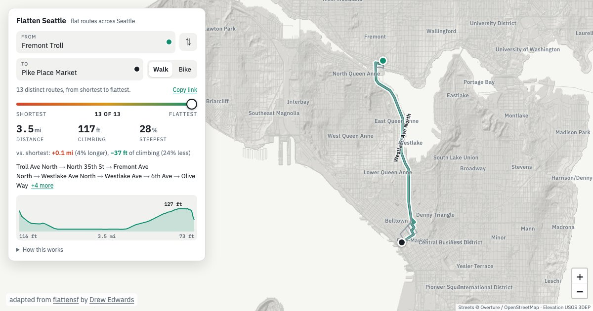

# Flatten Seattle

The flattest walking or biking route between any two places in Seattle, and
every route between it and the shortest.



Seattle is hilly: Queen Anne, Capitol Hill, Beacon Hill and the ridges
between the lakes. But the hills have gaps, valleys and waterfront flats
between them, so the shortest route is rarely the only way to get somewhere.
Type where you are and where you are going, then drag the slider from
**shortest** to **flattest**. The slider steps through every route that no
other route beats on both distance and climbing, so sliding right never
shortens the route and never adds climbing. The numbers, the elevation
profile and the list of streets follow the slider. The faint lines are the
other routes, so you can see where they agree and where they part.

On a bike, **prefer calm streets** (on by default) measures distance by
comfort rather than raw length. A block with a protected lane, neighborhood
greenway or trail from SDOT's bike facilities counts for less than its
length, and a busy arterial with no lane counts for more. Untick it, and the
shortest end of the slider is the true shortest path.

Routes stop at the city limits. Bridges out of the city (I-90 and SR 520)
end at the shore, so the finder gets you to the bridge.

This is a fork of [flattensf](https://github.com/almostimplemented/flattensf),
which does the same for San Francisco. The routing engine and page are
theirs; this fork swaps in Seattle data and tunes the network build for it.

## Running it locally

The built site is committed in [`site/`](site/). It loads its street graph
with `fetch`, so serve it over HTTP rather than opening the file:

```sh
python3 -m http.server 8000 -d site
# then open http://localhost:8000/
```

There is also a single-file build at `outputs/flatten_seattle.html`, with
the graph, places and hillshade embedded, which opens straight from disk.

## How it works

Place search works offline. Street intersections ("Pike & 3rd"), addresses
("1234 NE 45th St"), and parks, landmarks, stations and shops are built into
the page from the street graph and Overture's places, addresses and base
themes. There is no geocoding API, so there is no key to leak. You can also
click the map or drag either pin. Pins snap to the nearest street corner, so
a route never starts or ends inside a building. "Copy link" gives a URL that
reopens the exact trip.

The site is static: the page, its CSS and JS, the whole street graph as one
gzipped file of about 6 MB, and a lidar hillshade PNG. Every route is solved
in the browser.

The graph is built from:

| Data | Source |
|---|---|
| Streets, paths, stairs, access rules | Overture Maps transportation theme (OpenStreetMap) |
| Elevation | USGS 3DEP 1 m lidar DEM, King County 2021 |
| City boundary, neighborhoods | Seattle GeoData Neighborhood Map Atlas |
| Bike comfort | SDOT Bike Facilities |
| Places, addresses | Overture Maps places, addresses and base themes |

`python -m flatten_seattle sources` prints the full provenance table.

The build differs from upstream in a few places:

- **Sidewalks.** Most Seattle sidewalks are mapped as separate footways with
  no tag saying so. Footways that run alongside a street are dropped, so the
  street stands in for them. Footways that shortcut the street network
  (the Ballard Locks walkway, for example) are kept.
- **Water.** King County's lidar sets each lake and the Sound to one flat
  elevation. The hillshade masks those flat areas so the water renders as
  water.
- **Size.** Pass-through nodes are merged, nodes are stored in Z-order with
  delta-coded coordinates, and drawn geometry is simplified to 1 m. Together
  these shrink the graph from 9.9 MB to 6.2 MB gzipped.

## Building from scratch

Rebuilding needs Python 3.12 and about 750 MB of cached lidar and Overture
data.

```sh
uv venv --python 3.12 .venv && uv pip install -r requirements.txt
.venv/bin/python -m flatten_seattle download        # fetch and cache source data
.venv/bin/python -m flatten_seattle build-network   # graph, elevation, metrics
.venv/bin/python -m flatten_seattle site            # site/ and outputs/flatten_seattle.html
.venv/bin/python -m pytest
```

After changing the network build, run `build-network --force`. City settings
(bounding box, lidar project, place overrides such as where Pike Place Market
puts you) are in `flatten_seattle/config.py` and `flatten_seattle/sources.py`.
The package was `sf_flat_routes` upstream; git follows the rename when
merging upstream changes.

Upstream's corridor, pass and barrier analysis, the explorer page and the
warped-city view are still in the package but are not part of the Seattle
build yet.

## Deployment

`.github/workflows/pages.yml` publishes `site/` to GitHub Pages on pushes to
`main` or `seattle`. The site is committed already built, because CI does
not have the cached data.

## Licence

MIT, as upstream. See [LICENSE](LICENSE).
